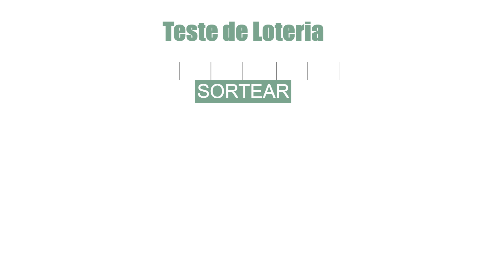
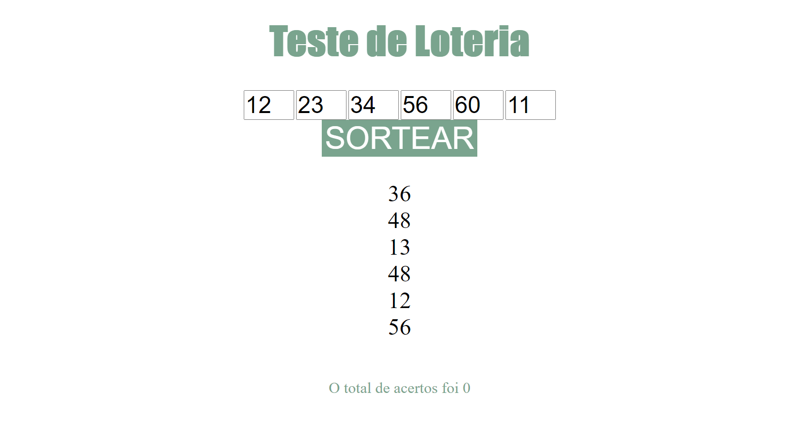

Este projeto é um simulador da *megasena*, onde o usuário digita seis números.
E sorteamos aleatoriamente outros seis números e comparamos para verificar quantos números você acertou.

**Não é para jogos oficiais**

## Tecnologias utilizadas
1. **HTML**: HTML é uma linguagem de marcação utilizada na construção da estruturas das páginas na Web.
2. **CSS**: Cascading Style Sheets (CSS) é um mecanismo para adicionar estilo (cores, fontes, espaçamento, etc.) a um documento web.
3. **JS**: JavaScript (frequentemente abreviado como JS) é uma linguagem de programação interpretada estruturada, de script em alto nível com tipagem dinâmica fraca e multiparadigma (protótipos, oriantado, a objeto, imperativo e, funcional).
4. ~~**Jquery**~~: Não foi utilizado.

## Funções Principais

Aqui será apresnetado as duas funções principais do site

### Sorteio de Números

Nessa função os números são sorteados aleatoriamente

```
function Sorteio(){
	let num= Math.floor(Math.random() * 60);
	let li = document.createElement("li");
    for (var i = 0; i < 6; i++) {
		numSort[i] =num;
		if(numSort[i]<=9){
			numSort[i]='0'+numSort[i];
		}else{
			numSort[i]=''+numSort[i];
		}
		num= Math.floor(Math.random() * 60);
		while(numSort.indexOf(num)!=-1){
			num= Math.floor(Math.random() * 60);
		}
    }

	for (var i = 0; i < 6; i++){
		li = document.createElement("li");
		li.innerHTML = numSort[i];
		document.getElementById("numSort").append(li);
	}
}

```

### Lendo os números digitados
Lê as entradas de números digitadas pelo usuário
```
function addToList(num, pos){
    if(num.length == 2){
        if(numEsco.indexOf(num)!=-1){
            alert2("Erro","Número escolhido anteriormente. Digite outro número")
        }else if(parseInt(num)>60){
            alert2("Erro", "O números digitado não pode ser maior que 60")
        }else{
            numEsco[pos] = num;
        }
    }
}

```

## Como Rodar o Código
Simplesmente baixe o código e abra o arquivo **_index.html_** no seu navegador

##Imagens da Tela
Tela 1: Tela de Abertura

Tela 2: 6 números digitados e nenhum sorteado


###Referências
* HTML: [Wikipedia](https://pt.wikipedia.org/wiki/HTML)
* CSS: [W3Schools](https://www.w3schools.com/css/)
* Java Script: [Wikipedia](https://pt.wikipedia.org/wiki/JavaScript)
